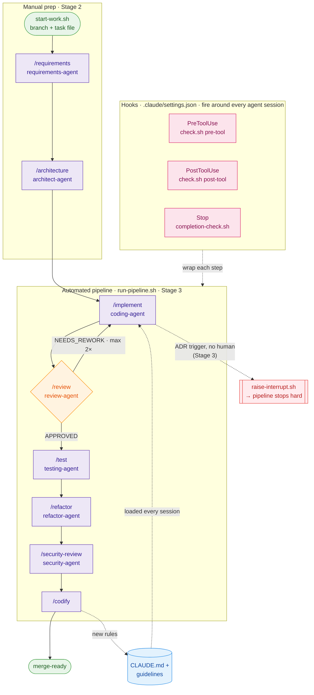

# dm Development Factory – Template

**Version: v0.5.0** · [Changelog](docs/CHANGELOG.md)

> *"Don't build the features – build the factory that builds the features for you."*

A reusable project template for deterministic, AI-assisted software development
with Claude Code. Set it up once, clone it into any new project, and start with a
structured, quality-assured pipeline from day one.

---

## The Concept: From Tool to Factory

Most teams today use AI assistants like an improved autocomplete – the developer
manually controls every step, the AI writes code suggestions.
That's **Stage 2: Manufactory**. Productive, but far from the optimum.

**Stage 3: Factory** goes further. A deterministic pipeline orchestrates multiple
specialized AI agents – each with a clear role, its own context, and defined quality
gates in between. The developer designs the factory, not the individual feature.

```
Manufactory:  Developer → [Claude] → Code
                           ↑
                    Every step manual

Factory:      Requirements → Architecture → Implementation ↔ Review
                                                ↓
                                          Tests → Security → Refactoring → Codify
                                                ↑
                        Deterministic scripts orchestrate the AI steps
```

**The central architectural principle:**
> Shell scripts call agents – never the other way around.

---

## What this template contains

### 7 Specialized Agent Roles

Each agent has a clearly defined responsibility, its own tools, and its own
quality standards. No agent does everything – each does its job well.

| Agent | Responsibility | Can write code? |
|-------|---------------|-----------------|
| **Requirements** | Clarify requirements, define acceptance criteria | Spec files only |
| **Architect** | Technical decisions, create ADRs | ADRs only |
| **Coder** | TDD implementation following spec and architecture | Yes |
| **Reviewer** | Multi-perspective code review (logic, quality, architecture) | No |
| **Security** | OWASP-based security check | No |
| **Tester** | Complete test suite, ensure coverage | Test files only |
| **Refactorer** | Clean code pass – no new behavior, only better structure | Yes |

### 15 Pipeline Skills (Slash Commands)

Skills are reusable prompt building blocks called in Claude Code as `/skillname`.
They are designed to work both manually (Stage 2) and in an automated pipeline (Stage 3).

| Skill | When to use |
|-------|-------------|
| `/setup-project` | Once – analyzes the tech stack, populates PROJECT-CONTEXT.md |
| `/requirements` | At the start of every feature – spec and acceptance criteria |
| `/architecture` | For technical decisions – creates ADRs |
| `/implement` | TDD-based implementation |
| `/review` | Code review from three perspectives |
| `/security-review` | Security check based on OWASP Top 10 |
| `/test` | Complete test suite, verify coverage |
| `/refactor` | Clean code pass after implementation |
| `/bug-fix` | Reproduce → isolate → fix → verify – for bugs, not features |
| `/pr-shepherd` | Guide a PR through its full lifecycle to merge |
| `/codify` | Extract learnings – bugs become rules |
| `/release-notes` | Generate changelog from the last N features before a release |
| `/daily-metrics` | Process health report – lead-time, autonomy rate, CI pass rate |
| `/post-merge-verify` | Healthcheck the deployed app after merge – CI-green ≠ prod-green |
| `/pipeline` | Stage 3: fully automated execution of all steps |

### Non-Negotiable Coding Standards

Five guideline files that Claude loads with every session:

- **Clean Code** – Naming, SRP, function size, no magic numbers
- **TDD Principles** – Red→Green→Refactor, why test-first works
- **Testing Standards** – Arrange-Act-Assert, mocking rules, flaky test policy
- **Architecture Principles** – Dependency rule, SOLID, error handling, API design
- **Git Workflow** – Branch naming, commit conventions, merge rules

### Deterministic Quality Gates

```bash
scripts/checks/pre-commit.sh       # Lint, no debug statements, no credentials
scripts/checks/pre-push.sh         # All tests must pass, no direct push to main
scripts/checks/completion-check.sh # No open checkboxes = not done
scripts/checks/branch-name-check.sh # Enforces the branch naming convention
scripts/checks/git-context-check.sh # Warns when working on a stale base
```

Gates are hard checks – not recommendations. They block the next step.
The check scripts are themselves covered by a self-test suite
(`scripts/checks/tests/run-tests.sh`, 36 cases) so the guardrails stay trustworthy.

### Continuous Integration (GitHub Actions)

The same gates that run locally also run on every push and pull request
(`.github/workflows/factory-ci.yml`):

| Workflow | Job | Runs |
|----------|-----|------|
| `factory-ci.yml` | `factory-self-test` | Always – validates the factory scripts themselves |
| `factory-ci.yml` | `issue-sync` | Always – every `tasks/task-<id>-*.md` must have a GitHub issue `#<id>` (ADR-013) |
| `factory-ci.yml` | `lint` | `FACTORY_LINT_COMMAND` (set as a repository variable) |
| `factory-ci.yml` | `test` | `FACTORY_TEST_COMMAND` (set as a repository variable) |
| `factory-ci.yml` | `post-merge-verify` | Default branch only – `FACTORY_HEALTHCHECK_CMD` (any smoke test) or `FACTORY_HEALTHCHECK_URL` after merge |
| `factory-poll.yml` | `factory-poll` | Scheduled workflow only – picks up `factory::run` issues and runs the factory (ADR-008) |

The jobs run on GitHub-hosted `ubuntu-latest` runners, which already ship
`bash`/`git`/`jq`; the workflows fetch `yq` (and the `claude` CLI for the poll
job) at runtime. No prebuilt container image or registry is needed.

Set `FACTORY_LINT_COMMAND` / `FACTORY_TEST_COMMAND` once under
**Settings → Secrets and variables → Actions → Variables** – the same values the
pre-commit / pre-push hooks read, so there is no double maintenance. Adopted
projects inherit the workflows automatically on clone. Until the commands are
configured the `lint` / `test` jobs **fail** rather than passing as green
no-ops – a missing gate must never look like a passing one ("gates over trust").

### Usage Telemetry (OpenTelemetry)

The factory ships OTEL-ready so every adopted project can export **token, cost
and usage telemetry** from day one – broken down per model, per skill and per
agent persona. This is the LLM-call dimension that the process metrics
(`/daily-metrics`) deliberately do *not* cover (see
[ADR 006](docs/adr/006-measurement-architecture.md)).

Telemetry is **off by default**. Enable it by sourcing the example config before
running the pipeline:

```bash
set -a; source config/otel.env.example; set +a   # adjust endpoint/token first
bash scripts/run-pipeline.sh 42
```

Key points:
- **Client-side instrumentation** – emitted regardless of backend: direct API
  key, Bedrock, Vertex, Foundry, or an **AI gateway routing a non-Anthropic
  model**. Routing through a gateway does not lose telemetry.
- `claude_code.token.usage` stays exact; `claude_code.cost.usage` (USD) becomes
  an **approximation** under non-Anthropic pricing → take authoritative cost from
  the gateway, attribution from OTEL.
- **Traces** (beta) are off by default – enable with
  `CLAUDE_CODE_ENHANCED_TELEMETRY_BETA=1` plus `OTEL_TRACES_EXPORTER`; behind a
  custom `ANTHROPIC_BASE_URL` also set `CLAUDE_CODE_PROPAGATE_TRACEPARENT=1`.
  Metrics and logs need none of these.

See `config/otel.env.example` for the full, commented variable set.

---

## A Feature Through the Pipeline – Example



Each pipeline step (purple) is run by a dedicated agent persona, labeled in the node;
`/codify` is the one step without its own persona. **Solid arrows** are the deterministic
flow — note the automated pipeline (`run-pipeline.sh`) starts at `/implement`;
`/requirements` and `/architecture` are manual Stage-2 prep. **Dotted arrows** are the two
feedback mechanisms: the **self-improvement loop** (`/codify` writes new rules every later
session loads) and the **Stage-3 interrupt** (a non-automatable decision stops the pipeline
hard instead of silently continuing). The **hooks** (pink) defined in `.claude/settings.json`
fire around every agent tool-call. In addition, `run-pipeline.sh` runs quality gates
(Lint/Tests/Coverage) between steps, and git-level `pre-commit`/`pre-push` guard commits and pushes.

```
1. Developer: bash scripts/start-work.sh 42 discount-logic-refactoring
   → Branch feature/42-discount-logic-refactoring is created
   → tasks/task-42-discount-logic-refactoring.md is created

2. /requirements 42
   → Requirements agent asks targeted questions
   → Creates docs/specs/spec-42-discount-logic.md with testable acceptance criteria

3. /architecture 42
   → Architect agent evaluates technical options
   → Creates ADR if a long-term decision is needed

4. /implement 42
   → Coding agent works strictly with TDD: test first, then implementation
   → Local quality gates (lint + tests) must be green

5. /review 42
   → Review agent checks from three perspectives: logic, quality, architecture
   → Result: APPROVED or NEEDS_REWORK
   → On NEEDS_REWORK: back to /implement (max. 2 iterations, then escalate)

6. /test 42
   → Testing agent completes the suite and verifies coverage

7. /refactor 42
   → Refactoring agent improves structure – no new behavior
   → Tests must be identically green before and after

8. /security-review 42
   → Security agent checks OWASP Top 10 on the final, refactored code (ADR-005)
   → Critical findings block the merge

9. /codify 42
   → Extracts patterns from review findings
   → Writes new rules back into CLAUDE.md and guidelines
   → The harness improves with every feature
```

---

## Stage 2 → Stage 3: The Evolution Path

This template is designed for both stages.

**Stage 2 – Today (manually driven):**
```bash
# Developer consciously calls each step
/requirements 42
/implement 42
/review 42
```
The developer retains full control, learns the system,
and decides when the next step starts.

**Stage 3 – Goal (deterministically automated):**
```bash
# Pipeline runs through, circuit breaker escalates on non-convergence
bash scripts/run-pipeline.sh 42

# Dry-run: shows every step without calling Claude
bash scripts/run-pipeline.sh 42 --dry-run
```
Skills require no conversation memory – they read from task files
and write results back. This makes Stage 3 a simple
extension of Stage 2, not a rebuild.

### Stage 3 pipeline features

**Pre-flight checks** run automatically before the first Claude call:
- Blocks if `PROJECT-CONTEXT.md` still contains `{{placeholders}}` → run `/setup-project` first
- Blocks if the git working tree has uncommitted changes
- Warns if no spec file exists for the task (recommends `/requirements` first)

**Optional PR shepherd (Phase 7):** run `PR_SHEPHERD=true bash scripts/run-pipeline.sh 42`
to drive the MR through its lifecycle to auto-merge after codify (rebase, CI, approval, merge).
Without the flag the pipeline stops after `/codify` and prints the next manual step.

**Per-skill model tier & turn limits live in [`factory.defaults.yml`](factory.defaults.yml)** – the
canonical config `run-pipeline.sh` reads (ADR-009). Each skill gets a `tier` (→ model) and a
`max_turns` budget; unknown skills fall back to the `default` section. Today's values:

| Skills | Tier → model | Max turns |
|--------|--------------|-----------|
| `implement`, `bug-fix` | heavy → `claude-opus-4-8` | 20 |
| `review`, `security-review` | heavy → `claude-opus-4-8` | 8 |
| `test`, `refactor` | light → `claude-sonnet-4-6` | 20 |
| `codify`, `pr-shepherd` | light → `claude-sonnet-4-6` | 8 |
| `requirements`, `architecture`, `release-notes` | light → `claude-sonnet-4-6` | 6 |

Teams adjust this **without patching scripts**: drop a `factory.config.yml` next to the defaults;
the two are deep-merged (override wins). `yq` is a prerequisite. (Requires Claude Code ≥ v2.1.154 for Opus 4.8.)

**Cost control levers** – all overridable via environment variables (override the config):
```bash
CLAUDE_MODEL_HEAVY=claude-sonnet-4-6 bash scripts/run-pipeline.sh 42  # cheaper heavy-tier model
CLAUDE_MODEL_LIGHT=claude-haiku-4-5 bash scripts/run-pipeline.sh 42   # cheaper light-tier model
CLAUDE_MODEL=claude-haiku-4-5 bash scripts/run-pipeline.sh 42         # global override (disables tiering)
MAX_TURNS=5 bash scripts/run-pipeline.sh 42                            # global turn cap (overrides per-skill defaults)
MAX_REVIEW_ITERATIONS=1 bash scripts/run-pipeline.sh 42               # fewer review loops
```

**Retry logic** – each skill call retries up to 3 times with exponential backoff (10 s, 20 s) before the pipeline aborts.

**Pipeline summary** – after the last step, the pipeline prints a compact overview:

```
  Implementierung
  → Task #42: discount-logic-refactoring

  Code Review
  → Ergebnis: APPROVED (nach 1 Iteration(en))
  → Findings: 0 kritisch, 2 wichtig

  Security
  → Status: PASSED

  Codify – neue Regeln
  → 2 neue Regel(n) hinzugefügt
    - [PROJECT-CONTEXT.md] Discount-Berechnungen immer mit BigDecimal – wegen: Rundungsfehler
    - [CLAUDE.md] Keine direkte Prozentrechnung auf Float-Werten
```

The finding counts are parsed from `tasks/review-<id>.md`. The section headers in `/review`'s output format are therefore **binding** – deviations would cause incorrect counts. The `/release-notes` skill selects the last N features by task ID (numeric sort), not by file modification time, to avoid stale ordering when `/codify` touches older task files.

### Human-decision interrupt (deterministic stop)

Some steps reach a decision a machine must not make on its own – most notably an
**ADR trigger**: agents self-detect when an architectural decision needs to be recorded
as an ADR (see [ADR 002](docs/adr/002-adr-trigger-check-implementation.md)). In Stage 2 the
agent simply asks the human. In Stage 3 there is no human in the loop, so a different
mechanism is needed – otherwise the pipeline would either hang or, worse, silently
continue and report green while a decision is still pending.

The Factory solves this with a **file-based interrupt** that follows the core principle
(*scripts detect and stop deterministically, agents only signal*):

```
Agent detects a non-automatable decision
  → bash scripts/raise-interrupt.sh <task-id> <type> <message>
  → writes sentinel tasks/INTERRUPT-<task-id>.md

run-pipeline.sh after every step
  → scripts/checks/interrupt-check.sh <task-id>
  → sentinel found? → actionable message + blocker entry in the task file + exit 1
  → no sentinel? → pipeline continues
```

- The pipeline sets `FACTORY_STAGE=3` for every agent call. Skill (`/implement`) and persona
  (`coding-agent.md`) branch on it: in Stage 3 they raise an interrupt instead of asking.
- The **guarantee lives in the script** – if a sentinel exists, the pipeline stops hard,
  independent of model behavior (exactly like a failed quality gate).
- The pre-flight removes a stale sentinel from a previous run so a fresh run does not stop
  immediately. The mechanism is generic (any `type`/`message`); the ADR trigger is just its
  first consumer. See [ADR 004](docs/adr/004-stage3-interrupt-mechanism.md).

> **⚠️ Cost note:** `run-pipeline.sh` runs 6+ full Claude sessions back-to-back. This consumes
> significantly more tokens than interactive use. Opus 4.8 on the heavy steps raises quality but
> also cost – tune the tiers to your budget and use Stage 3 where the automation overhead is worth it.

---

## Pipeline vs. Dynamic Workflows

The Factory uses two complementary orchestration models. Choose based on the nature of the task:

| | Stage 3 Pipeline | Dynamic Workflows |
|---|---|---|
| **Use for** | One feature, governed flow | Large, exploratory, parallel work |
| **Examples** | Feature, bug fix, refactoring | Codebase-wide bug hunt, mass migration, security sweep |
| **Control flow** | Deterministic (shell script) | Dynamic (model-planned at runtime) |
| **Quality gates** | Hard stops – lint, tests, review | Model-orchestrated verification |
| **Audit trail** | Full Git history + task files | Session-level progress persistence |
| **Availability** | Always | Research Preview; enterprise admin-controlled |
| **Cost** | Predictable (per-skill turn limits) | Variable (tens to hundreds of subagents) |

Dynamic Workflows can be activated via the `ultracode` setting in Claude Code.
A dedicated `/audit` or `/migrate` skill is planned once the feature leaves Research Preview.

> See [ADR 001](docs/adr/001-dynamic-workflows-complementary-orchestration.md) for the full decision rationale.

---

## Quickstart: Setting Up a New Project

```bash
# 1. Clone this GitHub-based factory as the starting point
git clone https://github.com/nothra/tch-gastro-services my-project
cd my-project

# 2. Start your own git history
rm -rf .git && git init
git add -A && git commit -m "Initial commit from dm-factory-template (GitHub)"

# 3. Initialize the factory (asks for project name, stack, team)
bash scripts/init-factory.sh

# 4. Open Claude Code and start the tech stack analysis
# → In Claude Code: /setup-project
#   Claude automatically detects language, framework, build tool, test runner
#   and fully populates docs/factory/PROJECT-CONTEXT.md

# 5. Create the first task
bash scripts/start-work.sh 1 first-feature
```

After `init-factory.sh` + `/setup-project`, the factory is fully configured:
lint commands, test commands, and coverage thresholds are adapted to your stack.

---

## Project Structure

```
├── CLAUDE.md                        # Factory identity – always loaded by Claude
│
├── .claude/
│   ├── settings.json                # Hooks: quality gates trigger automatically
│   └── commands/                    # 14 skills as /slash-commands
│       ├── setup-project.md
│       ├── requirements.md
│       ├── architecture.md
│       ├── implement.md
│       ├── review.md
│       ├── security-review.md
│       ├── test.md
│       ├── refactor.md
│       ├── bug-fix.md
│       ├── pr-shepherd.md
│       ├── codify.md
│       ├── release-notes.md
│       ├── daily-metrics.md
│       ├── post-merge-verify.md
│       └── pipeline.md
│
├── config/
│   └── otel.env.example             # OpenTelemetry config (off by default)
│
├── docs/
│   ├── CHANGELOG.md                 # Version history (Keep a Changelog)
│   ├── factory/
│   │   ├── PROJECT-CONTEXT.md       # Project memory (populated by init)
│   │   ├── agents/                  # 7 specialized sub-agent personas
│   │   └── guidelines/              # Coding standards (always loaded)
│   └── adr/                         # Architecture Decision Records (001–008)
│
├── scripts/
│   ├── init-factory.sh              # One-time bootstrap
│   ├── start-work.sh                # Issue-first: create GitHub issue + branch + task file
│   ├── sync-issues.sh               # Ensure every task has a GitHub issue #<id> (ADR-013)
│   ├── run-pipeline.sh              # Stage 3 pipeline runner
│   ├── raise-interrupt.sh           # Agent signals a human-decision stop
│   ├── metrics.sh                   # Process metrics (lead-time, autonomy, CI rate)
│   ├── post-merge-verify.sh         # Post-merge healthcheck (CI-green ≠ prod-green)
│   ├── factory-poll.sh              # Async trigger: scheduled GitHub Actions poll of factory::run issues
│   └── checks/                      # Deterministic quality gates
│       ├── check.sh                 # Dispatcher
│       ├── pre-commit.sh
│       ├── pre-push.sh
│       ├── completion-check.sh
│       ├── branch-name-check.sh
│       ├── git-context-check.sh
│       ├── interrupt-check.sh       # Detects the interrupt sentinel, stops the pipeline
│       └── tests/run-tests.sh       # Self-tests for the check scripts
│
└── tasks/                           # Work tracking: one MD file per feature
```

---

## The Self-Improvement Loop

What makes the factory special: it gets better with every use.

The last pipeline step `/codify` analyzes completed work:
- Which mistakes were made repeatedly?
- What did the review agent flag again and again?
- Which architectural decisions were difficult?

These insights flow back as new rules into `CLAUDE.md`,
guideline files, and `PROJECT-CONTEXT.md`.

> *"Every bug the AI introduces becomes a rule that prevents the next one."*

After 10 features, the factory knows the typical mistakes of your project.
After 50 features, it has more context than any new developer in onboarding.

---

## Why Markdown Files Instead of a Database?

Everything in this template – task files, specs, ADRs, review findings –
lives as Markdown in Git. This has three key advantages:

1. **Observability:** Progress is visible in GitHub at any time, without extra tools
2. **Persistence:** AI agents have no long-term memory. Git does.
3. **Crash recovery:** The next session reads the task file and continues seamlessly

---

## Versioning

The template is versioned so adopted projects can tell which baseline they started from
and pull in later improvements deliberately. The current version is shown in the header
above and in `CLAUDE.md`; the full history lives in [docs/CHANGELOG.md](docs/CHANGELOG.md)
(Keep a Changelog format).

The convention is intentionally lightweight – no SemVer tooling, no CI release job, no
package registry. The template is adopted by cloning, so Git is the only distribution:

1. Every merged change is recorded under `[Unreleased]` (via `/release-notes`).
2. Before a milestone merge, `[Unreleased]` is promoted to `[x.y.z]` and the version is
   bumped in `README.md` and `CLAUDE.md`.

> **For adopted projects:** compare your baseline version against the current one to see
> which improvements you can backport manually.

---

## Prerequisites

- [Claude Code](https://claude.ai/code) installed and authenticated
- Git ≥ 2.30
- bash (macOS/Linux) or WSL (Windows)
- [`yq`](https://github.com/mikefarah/yq) – `run-pipeline.sh` reads `factory.defaults.yml` (ADR-009). `brew install yq` / `apk add yq`
- `jq` – used by the quality-gate hooks
- Project-specific tools (Java, Node, Go, etc.) are detected by `/setup-project`
