# Bedienungsanleitung für Veranstalter

**TCH Gastro Services – eine Veranstaltung von Anfang bis Ende abrechnen**

Diese Anleitung führt Sie Schritt für Schritt durch eine komplette Veranstaltung – vom Anmelden
bis zum Abschlussbericht. Sie ist für alle gedacht, die **wenig Erfahrung mit Apps** haben.
Jeder Schritt erklärt kurz: **Was tue ich?** und **Was passiert dann?**

> **Stand: 24. Juli 2026.** Die Bilder zeigen die App zu diesem Zeitpunkt. Wird die App später
> geändert, können einzelne Bildschirme etwas anders aussehen – der Ablauf bleibt gleich. Wer die
> App pflegt, findet am Ende unter **„Bilder aktualisieren"**, wie die Screenshots neu erzeugt
> werden.

---

## So lesen Sie diese Anleitung

- Lesen Sie die Schritte **von oben nach unten** – sie stehen in der Reihenfolge, in der Sie sie
  auch in der App durchlaufen.
- Zu jedem Schritt gibt es ein **Bild** des Bildschirms, den Sie sehen.
- Fachbegriffe (z. B. *Verzehr*, *Auslage*, *Spende*) sind im **Glossar** gleich unten in
  Alltagssprache erklärt.
- Sie können **nichts kaputt machen**: Solange eine Veranstaltung *offen* ist, lässt sich jede
  Eingabe korrigieren.

---

## Glossar – die wichtigsten Begriffe

| Begriff | Was es bedeutet |
|---------|-----------------|
| **Veranstaltung** | Eine Zusammenkunft, die abgerechnet wird – z. B. die wöchentliche Montagsrunde. Sie hat ein Datum, eine Kasse und einen Status (*offen* oder *abgeschlossen*). |
| **Teilnehmer** | Eine Person **oder** eine ganze Familie – also eine Abrechnungszeile. Mitglieder und Nicht-Mitglieder. |
| **Verzehr** | Alles, was ein Teilnehmer bekommen hat: Getränke, Essen und Kaffee. |
| **Auslage** | Geld, das jemand **vorgestreckt** hat (z. B. Getränke eingekauft) und zurückerstattet bekommt. Eine Auslage ist ein **eigener Vorgang** und mindert den Verzehr nicht. |
| **Kasse** | Der Topf, zu dem eine Veranstaltung gehört (**Montagsrunde** oder **Vereinskasse**). |
| **Spende** | Zahlt ein Teilnehmer freiwillig mehr, als sein Verzehr kostet, ist der Rest eine Spende. |

> Ausführlicher stehen diese Begriffe in der [Fachsprache des Projekts](../../specs/README-montagsrunde.md).

---

## Bevor Sie loslegen

- Sie brauchen **Zugangsdaten** (E-Mail + Passwort). Die bekommen Sie vom **Verwalter** des Vereins.
- Ihr Konto braucht die Rolle **Veranstalter**. Ohne sie sehen Sie die Veranstaltungen nicht
  (siehe [Wenn etwas nicht klappt](#wenn-etwas-nicht-klappt)).
- Die App läuft im **Browser** (Handy, Tablet oder Computer) und kann wie eine App installiert
  werden.

---

## Schritt 1 – Anmelden

**Was tue ich?** Öffnen Sie die App. Geben Sie Ihre **E-Mail** und Ihr **Passwort** ein und tippen
Sie auf **„Anmelden"**.

**Was passiert?** Sie landen auf der Startseite mit den Bereichs-Kacheln.

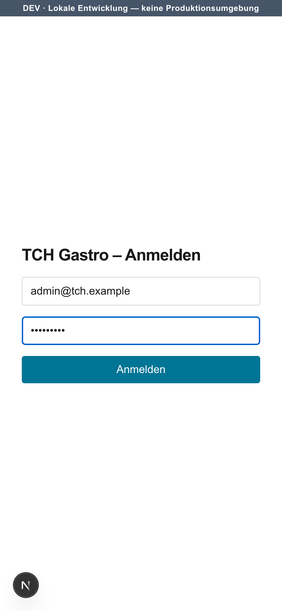

Nach dem Anmelden sehen Sie die Startseite. Tippen Sie auf die Kachel **„Veranstaltungen"**.

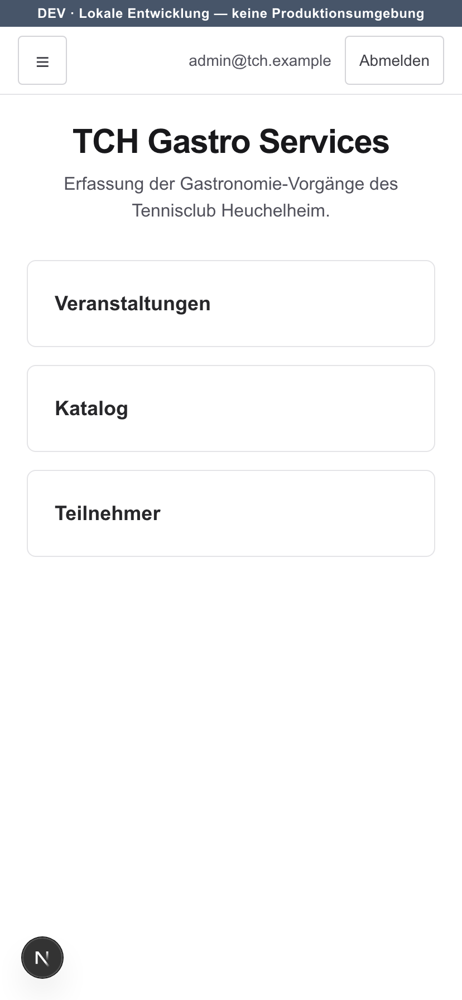

> Sehen Sie die Kachel **„Veranstaltungen"** nicht? Dann fehlt Ihrem Konto die Rolle
> *Veranstalter* – wenden Sie sich an den Verwalter (siehe unten).

---

## Schritt 2 – Veranstaltung anlegen

**Was tue ich?** Geben Sie im Formular **„Veranstaltung anlegen"** eine **Bezeichnung** ein
(z. B. „Montagsrunde"), wählen Sie das **Datum** und die passende **Kasse** und tippen Sie auf
**„Anlegen"**.

**Was passiert?** Die neue Veranstaltung erscheint darunter in der Liste – mit Datum, Kasse und dem
Status **„offen"**.

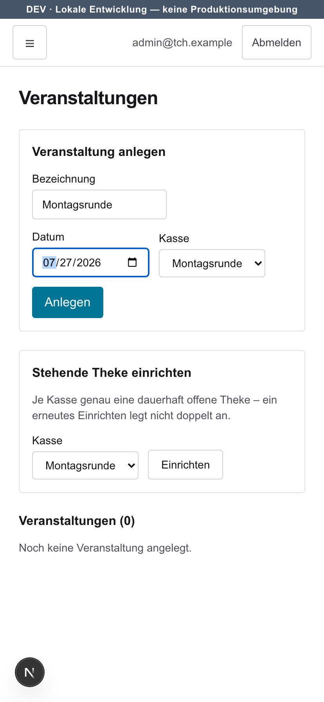

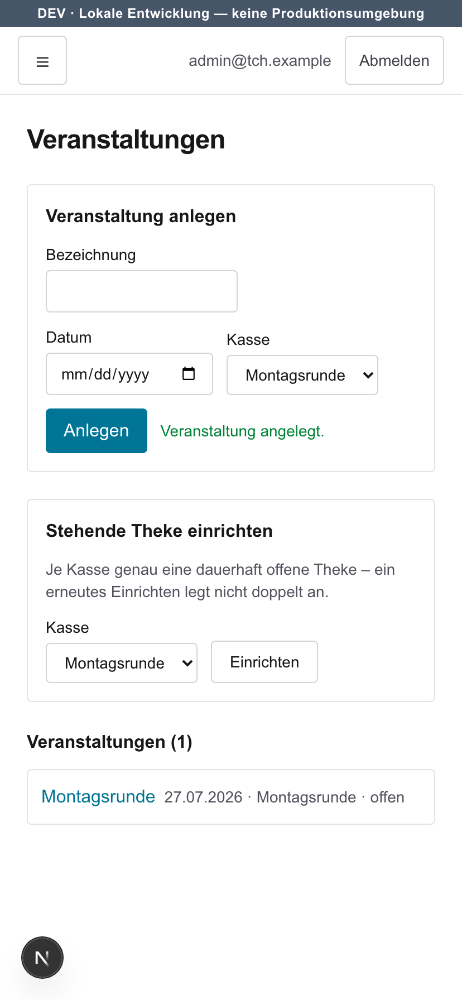

> Die **„Stehende Theke"** darunter müssen Sie in der Regel **nicht** einrichten – sie ist für die
> dauerhaft offene Theke gedacht und meist schon vorhanden.

Tippen Sie in der Liste auf den Namen der Veranstaltung, um sie zu **öffnen**.

---

## Schritt 3 – Veranstaltung führen (Teilnehmer erfassen)

Auf der Veranstaltungs-Seite steuern Sie alles Weitere. Oben sehen Sie die Schaltflächen
**„Verzehr erfassen →"**, **„Auslagen erstatten →"** und **„Kassieren →"** – damit gelangen Sie zu
den nächsten Schritten.

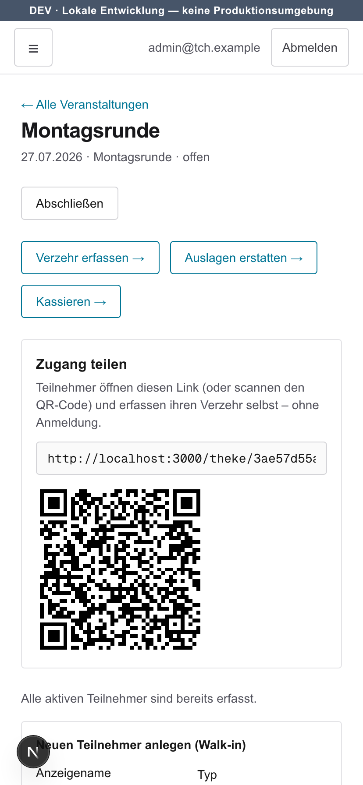

**Was tue ich?** Fügen Sie die anwesenden **Teilnehmer** hinzu:

- **Bekannte Person/Familie:** Wählen Sie sie unter **„Teilnehmer hinzufügen"** aus der Liste und
  tippen Sie auf **„Hinzufügen"**.
- **Neu, noch nicht in der Liste (Walk-in):** Tragen Sie unter **„Neuen Teilnehmer anlegen
  (Walk-in)"** den **Anzeigenamen** ein, wählen Sie **Person** oder **Familie**, setzen Sie bei
  Vereinsmitgliedern den Haken **„Mitglied"** und tippen Sie auf **„Anlegen & erfassen"**.

**Was passiert?** Jeder erfasste Teilnehmer erscheint unten in der Liste **„Teilnehmer"**.

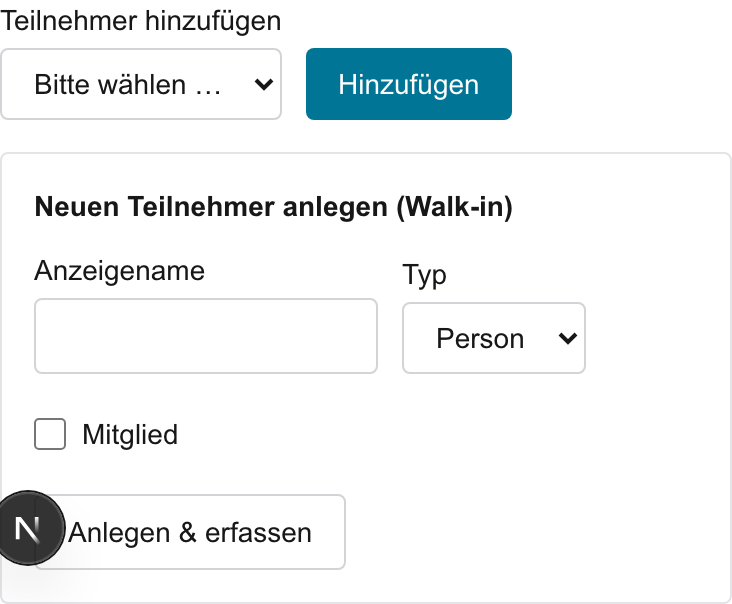

### Zugang teilen (Selbstbedienung)

Im Bereich **„Zugang teilen"** finden Sie einen **Link** und einen **QR-Code**.

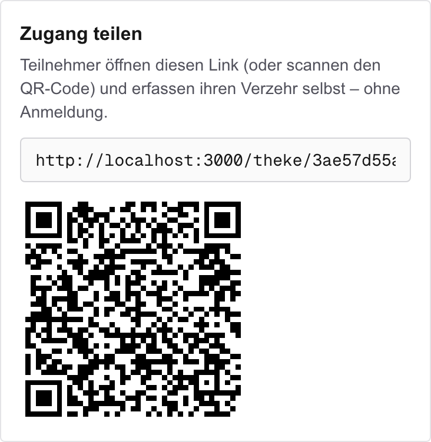

> **Tipp:** Teilnehmer können ihren Verzehr auch **selbst** erfassen – ganz ohne Anmeldung. Zeigen
> Sie dazu den QR-Code, oder geben Sie den Link weiter. Wer ihn öffnet, wählt seinen Namen und
> tippt sein Getränk/Essen selbst ein. Das ist praktisch, spart Ihnen Arbeit an der Theke und ist
> in [Schritt 4](#schritt-4--verzehr-erfassen) genauso beschrieben.

---

## Schritt 4 – Verzehr erfassen

**Was tue ich?** Tippen Sie auf **„Verzehr erfassen →"**. Oben wählen Sie über die Namensleiste
einen **Teilnehmer** aus; seine Karte klappt auf. Erhöhen oder verringern Sie je Artikel die Menge
mit den Schaltflächen **„+"** und **„−"** (Getränke, Essen, Kaffee).

**Was passiert?** Die Mengen und die Summen (Getränke / Essen / Kaffee / **Gesamt**) werden sofort
gespeichert und oben in der Karte angezeigt.

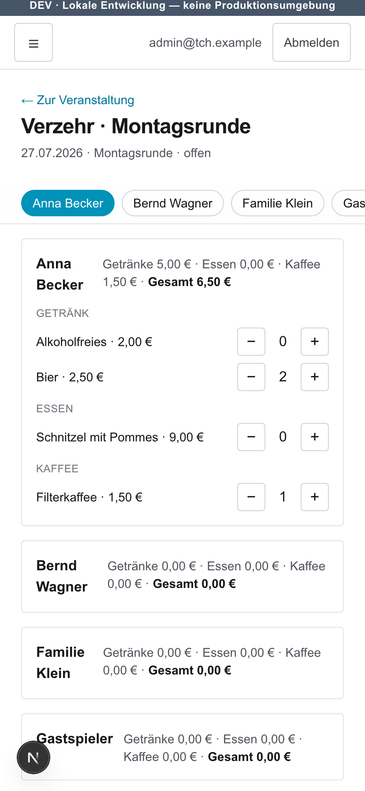

> **Selbstbedienung:** Statt alles selbst einzutippen, können die Teilnehmer ihren Verzehr über den
> **Link/QR-Code** aus [„Zugang teilen"](#zugang-teilen-selbstbedienung) selbst erfassen – ohne
> Anmeldung. Ihre Eingaben landen automatisch in derselben Liste.

---

## Schritt 5 – Auslagen erstatten

Hat jemand etwas **vorgestreckt** (z. B. Getränke gekauft), erfassen Sie das hier. Auslagen sind
ein **eigener Vorgang** und werden **nicht** mit dem Verzehr verrechnet.

**Was tue ich?** Tippen Sie auf **„Auslagen erstatten →"**. Wählen Sie den **Teilnehmer** und die
**Kategorie** (Getränke, Essen oder Sonstiges), tragen Sie den **Betrag (EUR)** ein (z. B. „15,00"),
optional eine **Notiz**, und tippen Sie auf **„Auslage erfassen"**.

**Was passiert?** Die Auslage erscheint in der Liste als **„offen zu erstatten"**.

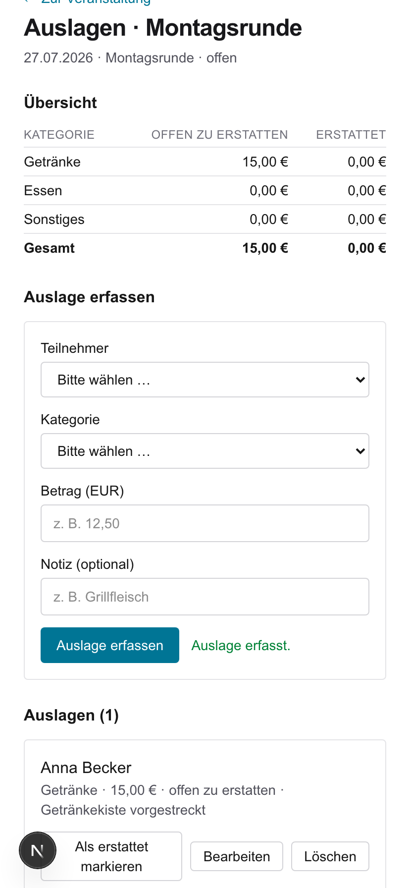

**Wenn Sie das Geld tatsächlich zurückgezahlt haben:** Tippen Sie bei der Auslage auf
**„Als erstattet markieren"**. Erst dann fließt der Betrag in die Gesamtabrechnung ein und
verringert die Kassenveränderung.

---

## Schritt 6 – Kassieren & Abschluss

**Was tue ich?** Tippen Sie auf **„Kassieren →"**. Jede Teilnehmer-Karte zeigt den
**Verzehr-Gesamt**. Tragen Sie im Feld **„Erhalten (EUR)"** ein, wie viel der Teilnehmer **bar
bezahlt** hat, und tippen Sie auf **„Kassieren"**.

**Was passiert?** Der Status springt von **„offen"** (gelb) auf **„bezahlt"** (grün). Zahlt jemand
mehr als seinen Verzehr, wird der Rest automatisch als **Spende** ausgewiesen.

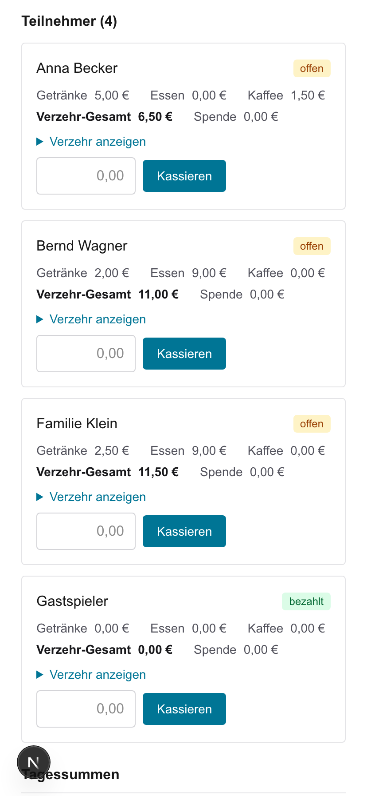

Weiter unten sehen Sie die **Tagessummen** und die **Gesamtabrechnung** der Kasse – inklusive
Einnahmen, erstatteter Auslagen und der **Kassenveränderung**.

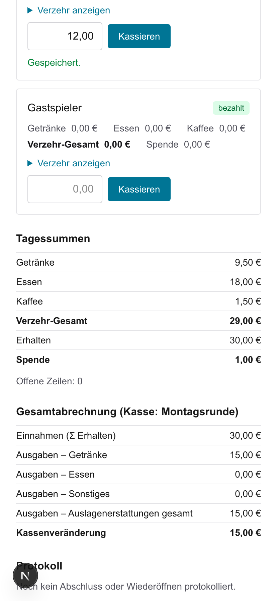

**Abschließen:** Sind **alle** Teilnehmer „bezahlt" (Anzeige **„Offene Zeilen: 0"**), tippen Sie
auf **„Abschließen"**. Ist noch eine Zeile offen, weist die App Sie darauf hin und schließt nicht ab.

> Versehentlich abgeschlossen? Über **„Wieder öffnen"** lässt sich die Veranstaltung erneut
> bearbeiten.

---

## Schritt 7 – Abschlussbericht herunterladen

**Was tue ich?** Nach dem Abschließen erscheint auf der Veranstaltungs-Seite der Bereich
**„Abschlussbericht"**. Darin stehen **zwei Gruppen** – wählen Sie zuerst die Gruppe, dann das
Format:

- **„Vollständig"** – der komplette Bericht mit allem: Getränke, Essen, Kaffee, Spenden, dem
  Erhaltenen und der Kassenveränderung.
- **„Nur Getränke"** – der Bericht für die Theke: ausschließlich der Getränke-Umsatz und die
  erstatteten Auslagen für Getränke. Spende, Erhaltenes und Kassenveränderung stehen **nicht**
  darin, weil sie sich nicht auf die Getränke allein aufteilen lassen.

In beiden Gruppen tippen Sie auf **„Excel (.xlsx) herunterladen"** oder **„PDF herunterladen"**.

**Was passiert?** Der fertige Bericht der Veranstaltung wird heruntergeladen – zum Archivieren,
Ausdrucken oder Weitergeben. Bei der Getränke-Fassung steht **„nur Getränke"** oben im Bericht
und `getraenke` im Dateinamen, damit Sie die beiden Fassungen nicht verwechseln.

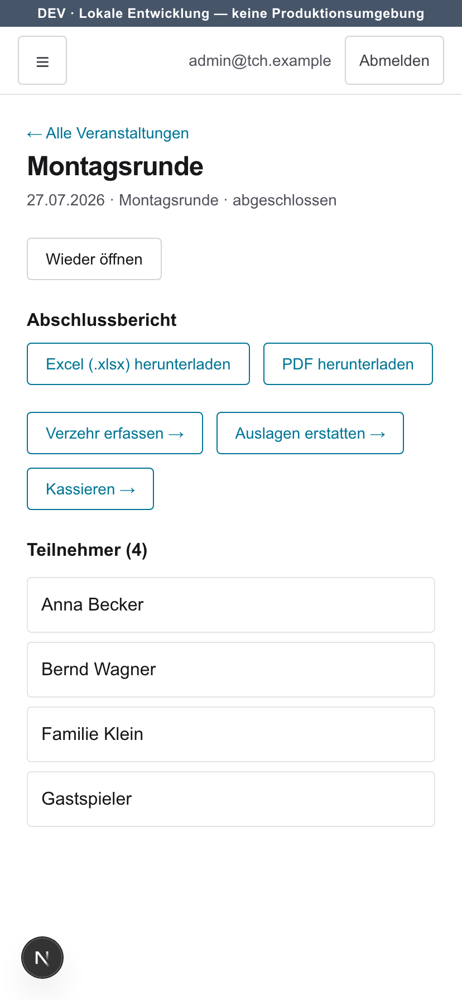

---

## Wenn etwas nicht klappt

- **Nach dem Anmelden fehlt die Kachel „Veranstaltungen" (oder die Liste erscheint nicht).**
  Ihrem Konto fehlt die Rolle **Veranstalter**. Das können Sie nicht selbst ändern – wenden Sie
  sich an den **Verwalter** des Vereins; er schaltet die Rolle frei.
- **Ich habe mich vertippt.** Solange die Veranstaltung **offen** ist, können Sie jede Eingabe
  ändern: Verzehr über „+"/„−", Auslagen über **„Bearbeiten"**, Erhaltenes durch erneutes
  Kassieren. Notfalls die abgeschlossene Veranstaltung **„Wieder öffnen"**.
- **Der Abschluss funktioniert nicht.** Es ist noch mindestens eine Teilnehmer-Zeile **offen**.
  Prüfen Sie unter „Kassieren" die Anzeige **„Offene Zeilen"** und kassieren Sie die restlichen.

---

## Bilder aktualisieren (für die App-Pflege)

Die Screenshots liegen unter `docs/anleitung/veranstalter/bilder/` und werden reproduzierbar aus
dem lokalen Entwicklungsserver erzeugt. Bei UI-Änderungen neu erzeugen:

```bash
# 1. Lokale Datenbank starten und auf einen frischen Stand bringen
pnpm db:up
# (optional, für ganz saubere Bilder: DEV-Daten leeren, dann neu seeden)
pnpm db:seed

# 2. Screenshots erzeugen (fährt den kompletten Veranstalter-Workflow durch)
CAPTURE_ANLEITUNG=1 pnpm exec dotenv -e .env.local -- playwright test e2e/anleitung-veranstalter.spec.ts
```

Das Skript liegt in [`e2e/anleitung-veranstalter.spec.ts`](../../../e2e/anleitung-veranstalter.spec.ts)
und legt seine Demo-Daten selbst an. Danach die geänderten Bilder committen und – falls nötig – die
Bildunterschriften in dieser Datei anpassen.

---

## PDF erzeugen (druckbare Fassung)

Die druckbare Fassung `anleitung.pdf` entsteht per **Browser-Druck** aus dieser Markdown-Datei –
ohne zusätzliches Werkzeug. So wird sie reproduzierbar neu erzeugt:

1. Diese Datei (`anleitung.md`) in **Visual Studio Code** öffnen und die Vorschau starten:
   Befehl **„Markdown: Vorschau öffnen"** (oder das Vorschau-Symbol oben rechts). Die Vorschau
   rendert die eingebetteten Screenshots aus `bilder/` mit.
2. In der Vorschau **rechtsklicken → „Drucken"** (bzw. `Strg`/`Cmd` + `P`).
3. Als Ziel **„Als PDF speichern"** wählen; Papierformat **A4**, Ausrichtung **Hochformat**,
   Ränder **Standard**, Option **Hintergrundgrafiken** aktivieren (damit die Screenshots und
   Tabellen-Hinterlegungen mitgedruckt werden).
4. Die Datei als `docs/anleitung/veranstalter/anleitung.pdf` speichern (vorhandene ersetzen).

> **Hinweis zum Aussehen:** Schrift und Seitenumbrüche hängen vom druckenden Programm ab – die
> committete `anleitung.pdf` kann daher geringfügig anders aussehen als ein frisch gedrucktes
> Exemplar; **Inhalt und Screenshots sind identisch**. Auf **GitHub** lässt sich die Datei zwar
> lesen, ein GitHub-Ausdruck enthält die lokalen Screenshots aber **nicht** – deshalb der Weg über
> die VS-Code-Vorschau.

> **Große, gut lesbare Darstellung:** Beim Drucken bei Bedarf die Skalierung leicht erhöhen
> (z. B. 110–125 %), damit Text und Screenshots für sehschwächere Leser groß genug sind.
